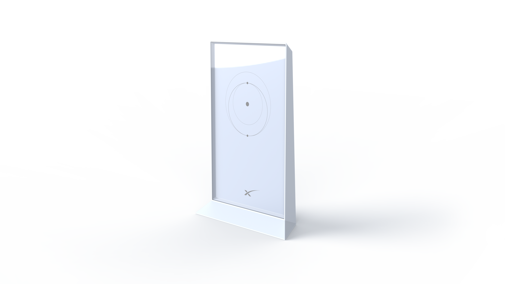

<p align="center"></p>

# <p align="center">Starlink WiFi Gen2 platform</p>

Starlink WiFi Gen2 routers are dual-band 3x3 802.11ac wireless routers based on MT7629 SoCs. This platform is derived from MediaTek's SDK, which in turn is based on [OpenWrt](https://openwrt.org/). We try to remain as close as possible to upstream OpenWrt.

**What's in the box:**
* Bootloaders, kernel, drivers, and build system for Starlink WiFi Gen2 routers.
* Anything that links against GPL2 or similarly licensed libraries.

**What's NOT in the box:**
* SpaceX applications which live in the `payload` repository (we're not ready to open source these yet).
* Vendor applications which have been omitted by request.


## Building

On any Linux box, [install Docker](https://docs.docker.com/engine/install) and generate the hermetic build container (optional inside SpaceX):
```sh
NO_PUSH=1 docker/build.sh
```

Then build the target image:
```sh
NO_CLEAN=1 scripts/build.sh
```

### Outputs

Build outputs are located under `bin/YYYY-MM-DD-COMMIT`:
* `v2-YYYY-MM-DD-COMMIT-upgrade.bin` - Upgrade image for `wifi_control --flash`.
* `v2-YYYY-MM-DD-COMMIT-single.bin`  - NAND image for U-Boot or NAND flasher.

For convenience, `bin/upgrade.bin` is a symlink to the most recent build.


### Options

* `NO_CLEAN=1`  - Enable caching for faster incremental builds.
* `OVERLAY=all` - Enable persistent root filesystem overlay for faster iteration.
* `PAYLOAD=...` - Use `wifi_control` from a local payload repository. Must already be built.
* `VERSION=...` - Use a custom version name for this build.


## Flashing

Connect to the router over ethernet or wireless, then copy over and flash your image:
```sh
scp bin/upgrade.bin root@StarlinkRouter:/tmp
ssh root@StarlinkRouter wifi_control --flash=/tmp/upgrade.bin --reboot
```

To prevent bricking by power loss or bad updates, each router stores two copies of software and alternates between them on each boot. Flashing always writes the inactive copy. **Flash twice to update both copies.**

Boot toggling is implemented in BL2 (the first non-ROM bootloader) of which there is only one copy. To update BL2 and both copies of all other software add `--update_full`. **Warning:** This is inherently unsafe.


## Jobs

We're quietly trying to build some of the best WiFi routers on the planet at ridiculously low cost. We work hard with tiny teams on incredibly tight schedules. If that sounds fun, email wifi@spacex.com with any of the following:
* The hardest technical problem you've solved.
* The most innovative electronics product you've designed and manufactured.
* The best security vulnerability you've found, or check out our [bug bounty program](https://bugcrowd.com/spacex).
* As many ways as you can think of to accurately measure per-frame MAC and PHY properties (MCS, EVM, spectral power distribution, ...) in realtime for under $1000.

Bonus points if you can tell us:
* What [this circuit](doc/board.png) on the board does.
* What the device at I2C address `0x20` does.

<p align="center"></p>